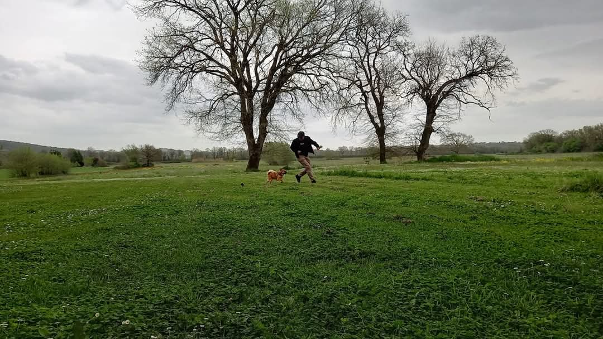

Questo sito raccoglie i miei progetti 

## Dharma

Ho dedicato al Buddhismo due libri: _La luna nell'acqua. Una mappa per perdersi nel Dharma del Buddha_ (Tethis, Torino 2019) e _Le dimore leggere. Saggio sull'etica buddhista_ (Petite Plaisance, Pistoia 2021).
_Dharma_ raccoglie traduzioni e analisi dei sutra e riflessioni.

## Il De Rerum Natura
La mia traduzione in endecasillabi del _Ds Rerum Natura_ di Lucrezio. 
[vai](antonio-vigilante.github.io/lucrezio)
